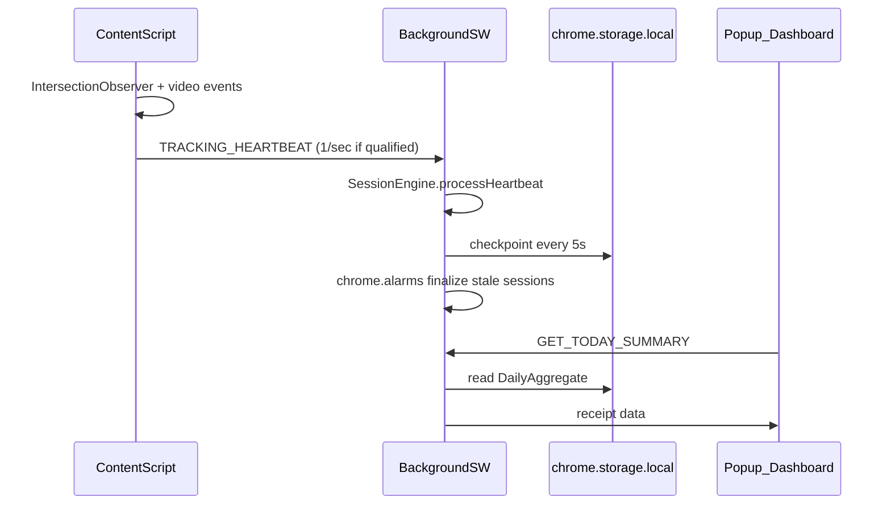

# Scroll Receipt — Browser Extension MVP Implementation Plan

**Version:** 1.0  
**Platform pivot:** Mobile (React Native) → **Chromium browser extension (WXT + MV3)**  
**Repository:** `/Users/vishnevsky/Desktop/check bill`  
**Status:** ✅ MVP implemented — build, tests, and ZIP pass

---

## Milestones

| # | Milestone | Deliverables |
|---|-----------|--------------|
| M1 | Foundation | WXT config, MV3 manifest, Tailwind, ESLint/Prettier/Vitest, shared types + Zod |
| M2 | Storage + Session Engine | chrome.storage repos, session engine, daily aggregation, background SW |
| M3 | Platform Adapters | YouTube Shorts, Instagram Reels, TikTok + active viewing detector |
| M4 | Thermal Receipt UI | Popup, dashboard, options, equivalent engine |
| M5 | Privacy + Data Controls | Export JSON, delete data, pause tracking, onboarding |
| M6 | Tests + Ship | Unit tests, adapter fixtures, build + zip, docs |

---

## Architecture Decisions

### Stack
- **WXT** (Manifest V3) + TypeScript strict
- **React** + Tailwind CSS v4 + Lucide icons
- **Zod** for all runtime message validation
- **Zustand** only for shared reactive UI state (dashboard tabs, reclaim stamp)
- **chrome.storage.local** via WXT storage; IndexedDB fallback if history exceeds limits
- **Vitest** + RTL for unit; **Playwright** for extension e2e where practical
- **pnpm** package manager

### Non-goals (MVP)
- No Supabase, auth, cloud sync, analytics
- No Safari/Firefox/mobile browsers
- No native mobile app tracking
- No network requests except user-initiated site loads

### Runtime Flow



---

## Project Structure

```
check bill/
├── entrypoints/
│   ├── background.ts              # Session engine, alarms, message router
│   ├── popup/                     # 380px max, status + today totals
│   ├── dashboard/                 # Full-page receipt app
│   ├── options/                   # Settings, export, delete
│   ├── youtube.content.ts
│   ├── instagram.content.ts
│   └── tiktok.content.ts
├── src/
│   ├── adapters/
│   │   ├── types.ts               # PlatformAdapter interface
│   │   ├── youtube.ts
│   │   ├── instagram.ts
│   │   └── tiktok.ts
│   ├── tracking/
│   │   ├── active-viewing.ts        # Qualified viewing detector
│   │   ├── session-engine.ts        # Start/merge/end/split-at-midnight
│   │   ├── daily-aggregation.ts
│   │   └── content-tracker.ts         # VIEWED/ENGAGED/COMPLETED rules
│   ├── storage/
│   │   ├── repositories.ts
│   │   └── defaults.ts
│   ├── receipts/
│   │   ├── equivalent-engine.ts
│   │   └── receipt-builder.ts
│   ├── components/receipt/        # Thermal UI primitives
│   ├── styles/receipt.css
│   ├── types/                     # Storage models, messages
│   └── utils/                     # hash, time, format, messages
├── tests/
│   ├── fixtures/                  # DOM fixtures per platform
│   ├── unit/
│   └── e2e/
└── docs/
    ├── IMPLEMENTATION_PLAN.md     # This file
    ├── ARCHITECTURE.md
    ├── PRIVACY.md
    └── PLATFORM_ADAPTERS.md
```

---

## Manifest V3 Permissions

| Permission | Why |
|------------|-----|
| `storage` | Persist sessions, aggregates, settings locally |
| `alarms` | Finalize stale sessions; daily receipt generation without SW staying alive |
| `idle` (optional) | Detect user idle state for qualified viewing |
| `notifications` (optional) | Daily receipt ready notification |

**Host permissions (scoped only):**
- `https://www.youtube.com/*`, `https://youtube.com/*`
- `https://www.instagram.com/*`, `https://instagram.com/*`
- `https://www.tiktok.com/*`, `https://tiktok.com/*`

No `<all_urls>`, no `history`, no `cookies`.

---

## Tracking Engine Spec

### Qualified Active Viewing (all must be true)
1. Supported site + route
2. Tab active + window focused
3. `document.visibilityState === 'visible'`
4. Short-form video detected
5. ≥60% video visible (IntersectionObserver)
6. Video playing + currentTime advancing
7. User not idle (if idle permission granted)

### Content Rules
- **VIEWED:** ≥2 qualified active seconds
- **ENGAGED:** ≥10 qualified active seconds
- **COMPLETED:** ≥90% of known duration
- **QUICK SKIP:** left before 2 seconds
- **CONTENT ADVANCES:** stable content ID changes

### Session Rules
- Start on first qualified second
- Merge gaps ≤30 seconds on same platform
- End after >30s without qualified viewing
- Split at midnight across calendar days
- Checkpoint every 5s for SW restart recovery
- Deterministic event IDs for deduplication

### Privacy
- Raw content IDs only in memory
- Persist daily salted SHA-256 hash only
- Never store URLs, captions, usernames, titles

---

## Platform Adapters

Each adapter implements `PlatformAdapter`:

```typescript
interface PlatformAdapter {
  matchesCurrentPage(): boolean;
  getPlatform(): SupportedPlatform;
  getCurrentContent(): DetectedContent | null;
  getActiveVideoElement(): HTMLVideoElement | null;
  startObserving(callback: ObserverCallback): CleanupFunction;
  getStableContentIdentifier(): string | null;
}
```

| Platform | Routes | Isolation |
|----------|--------|-----------|
| YouTube | `/shorts/*` | Selectors in `youtube.ts` only |
| Instagram | `/reels/`, `/reel/*` | Selectors in `instagram.ts` only |
| TikTok | `/foryou`, `/@*/video/*` | Selectors in `tiktok.ts` only |

One broken adapter must not crash others.

---

## Thermal Receipt Design Tokens

| Token | Value |
|-------|-------|
| page_background | `#24231F` |
| paper | `#F7F4EA` |
| paper_secondary | `#EEEADF` |
| primary_ink | `#171713` |
| faded_ink | `#747067` |
| divider | `#AAA59A` |
| stamp_red | `#C53A2F` |
| success_green | `#246B4B` |

Font: IBM Plex Mono (primary), Space Mono (fallback)

---

## Implementation Sequence

1. Update `package.json` scripts: `lint`, `typecheck`, `test`, `test:e2e`
2. Configure `wxt.config.ts` with manifest + Tailwind
3. Create `src/types/` models + Zod message schemas
4. Implement `src/storage/repositories.ts`
5. Implement `src/tracking/session-engine.ts` + unit tests
6. Implement `src/tracking/daily-aggregation.ts` + unit tests
7. Implement `src/tracking/active-viewing.ts`
8. Implement platform adapters + DOM fixtures
9. Wire `entrypoints/background.ts` message router
10. Create content script entrypoints (one per platform)
11. Build thermal receipt components
12. Implement popup, dashboard, options
13. Equivalent engine + receipt builder
14. Privacy onboarding on first install
15. Export/delete flows
16. Run `pnpm lint && pnpm typecheck && pnpm test && pnpm build && pnpm zip`

---

## Acceptance Criteria

- [ ] MV3 extension builds without errors
- [ ] Zero TypeScript and lint errors
- [ ] All unit tests pass
- [ ] Time counted only during qualified active viewing
- [ ] Inactive tab / paused video = zero seconds
- [ ] Three platforms in isolated adapters
- [ ] Daily receipts generated locally
- [ ] English-only thermal receipt UI
- [ ] No raw URLs or PII persisted
- [ ] No data leaves device
- [ ] Pause + delete all data works
- [ ] README with Chrome unpacked install steps
- [ ] `pnpm zip` produces production ZIP

---

## Current Repository State

**Done:**
- WXT React TypeScript starter (`pnpm install` complete)
- Dependencies added: zod, zustand, lucide-react, tailwindcss, vitest, eslint, playwright

**Pending:**
- All `src/` modules
- Content scripts (youtube, instagram, tiktok)
- Background session engine
- Thermal receipt UI
- Tests and documentation
- `wxt.config.ts` manifest customization
- Remove default `entrypoints/content.ts` template

---

## Next Step

Switch to **Agent mode** and execute this plan sequentially. Plan mode blocks code file edits.
